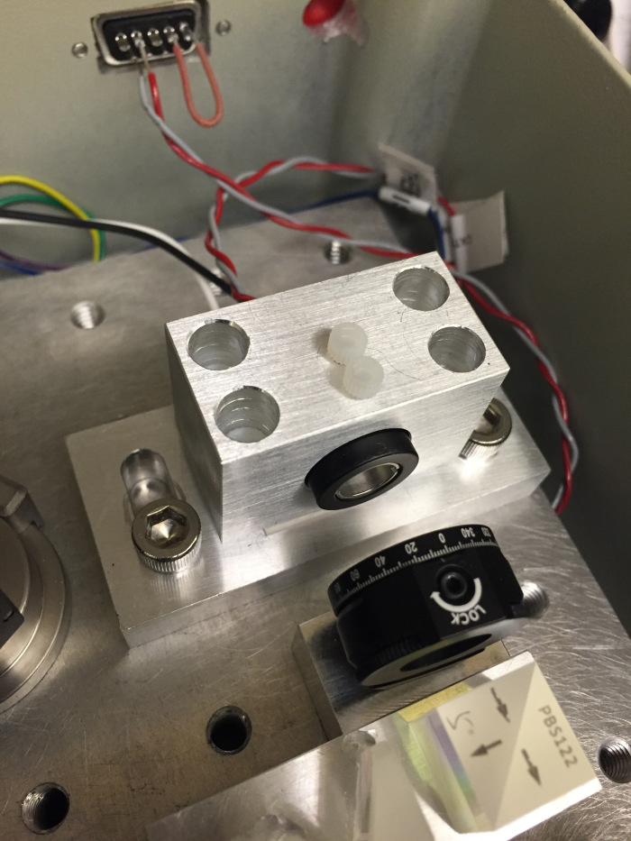
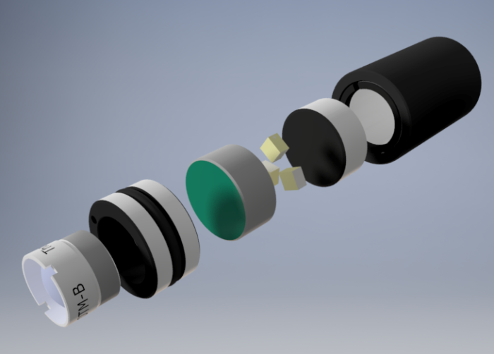
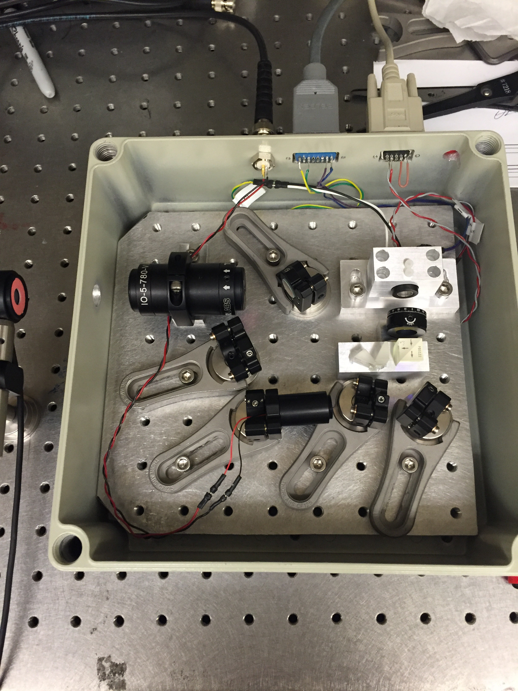

# IF-ECDL

### External cavity diode laser design

This is a design for an interference-filter-based external cavity diode laser. It is based mostly on commercial off-the-shelf parts. A separate parts list and drawings can be found in this repository.

## Assembly instructions

0. Drill holes in the box for feeding through the current controller, temperature controller and piezo driver.

1. Put the diode in a collimation tube, power it up and collimate it. Slide the diode + collimation tube into the diode mount, and tighten it using 4-40 nylon screws.

2. Line up the half-wave plate (HWP) and polarizing beamsplitter (PBS) in front of the diode. Adjust the anamorphic prisms on the output port of the PBS to obtain as circular a beam as possible. Put in an isolator downstream.

3. Assemble the cateye retroreflector (CRR) using the parts listed. Put the interference filter (IF), a fold mirror and the CRR on the feedback port of the PBS. Adjust the angle of the IF to maximize the transmission through it, then adjust the fold mirror and CRR until the threshold current of the diode drops significantly. Adjust the HWP angle to change the fraction of the laser's output that is sent into the feedback arm.

4. (Optional) Put pads of sorbothane underneath the breadboard. Add foam padding around the box for acoustic isolation.

